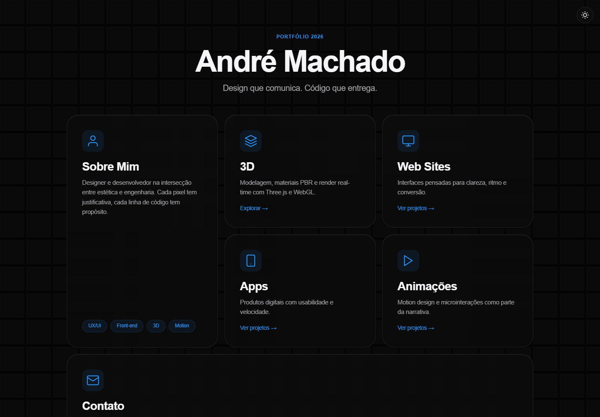
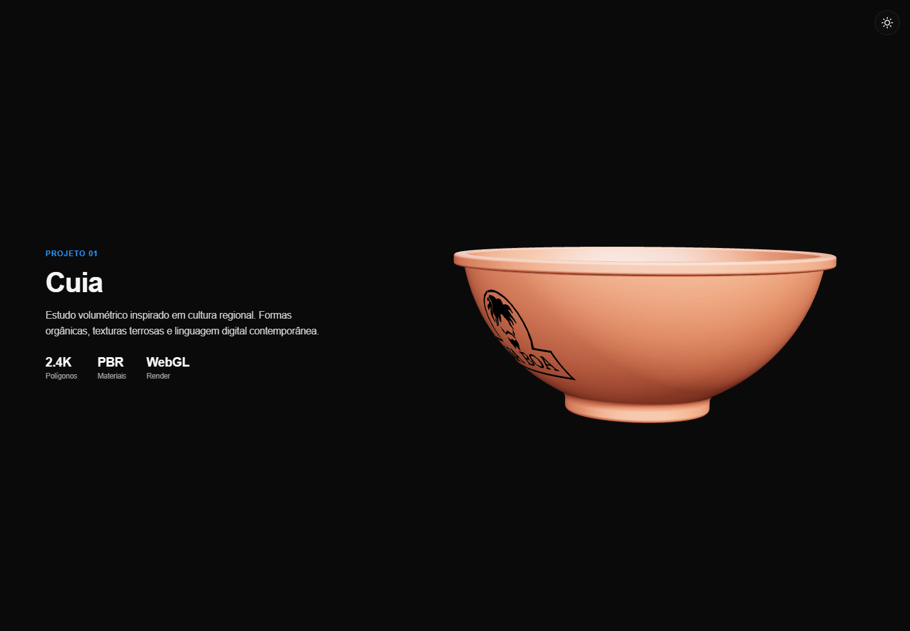
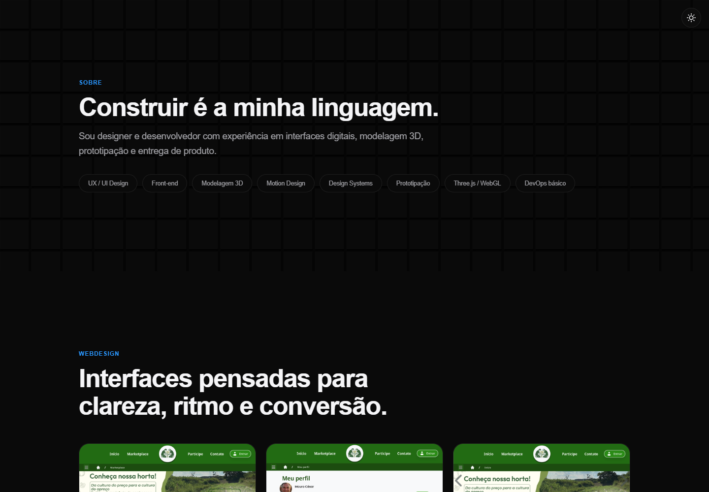
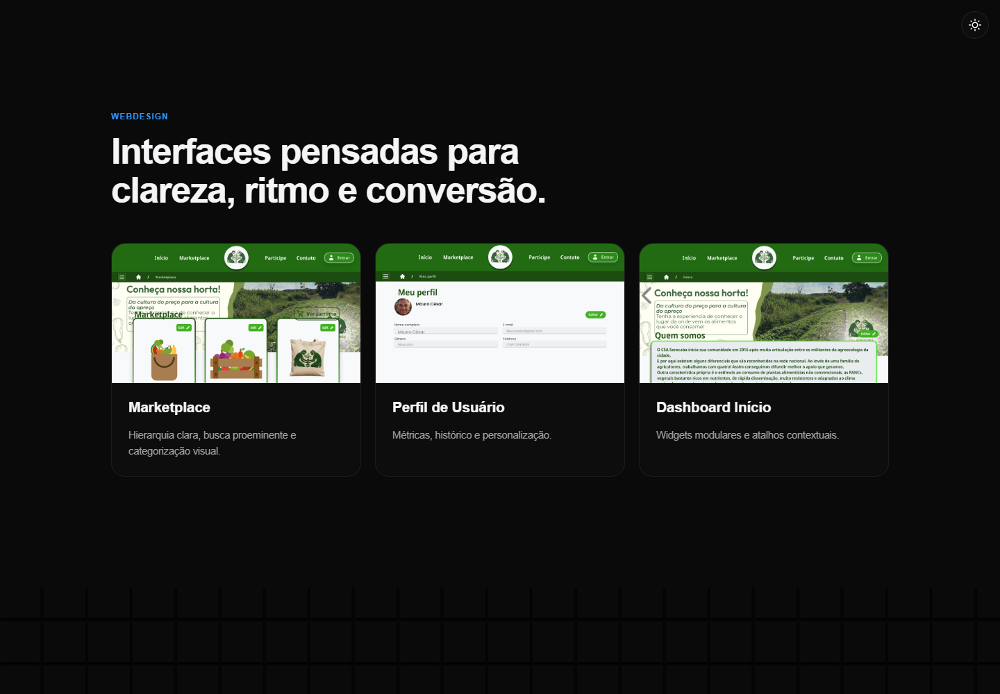
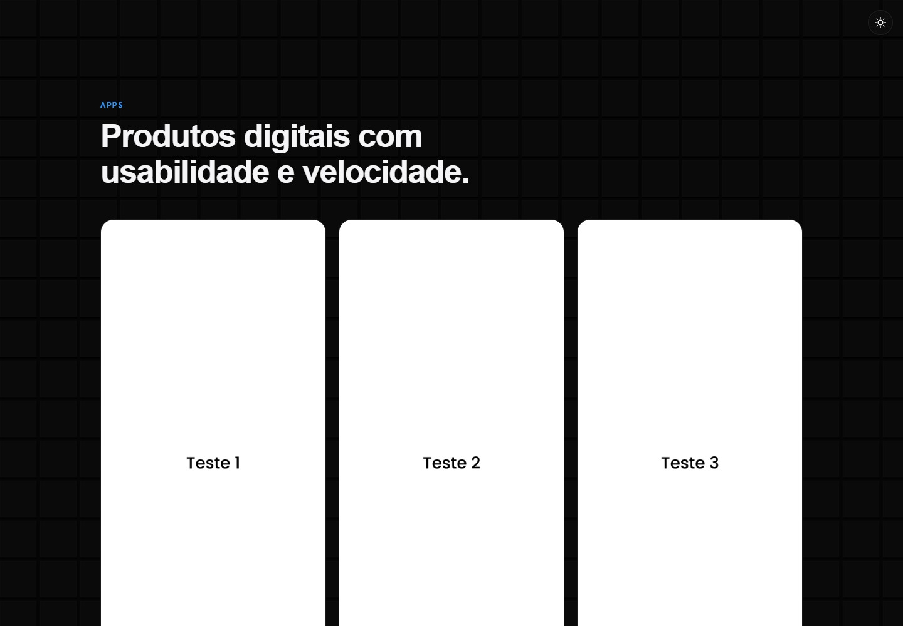
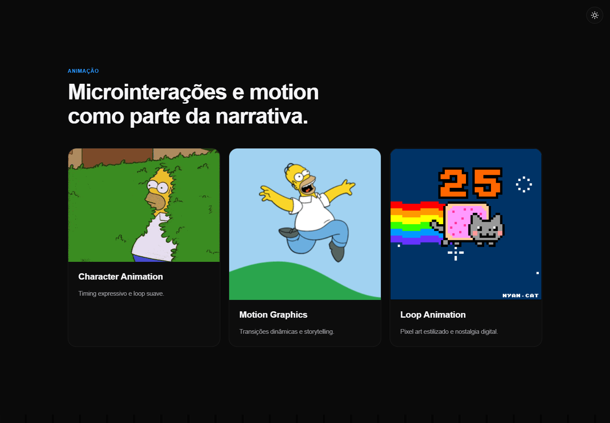
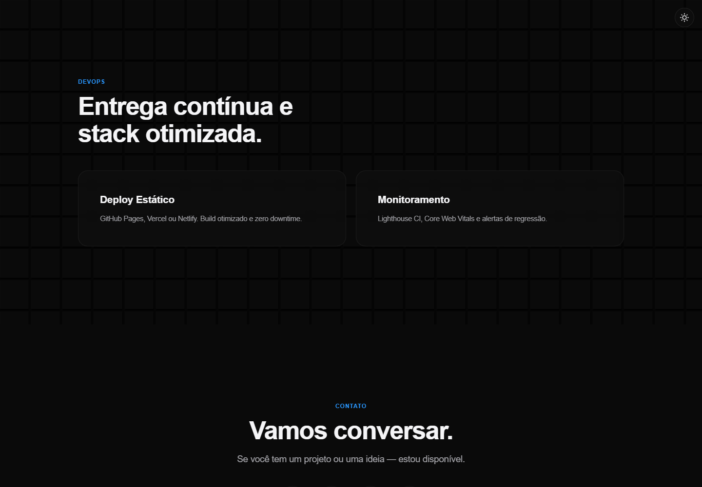

# Portfólio | André Machado

Portfólio pessoal de André Machado, reunindo trabalhos e experiências em design, desenvolvimento, modelagem 3D, interfaces digitais e motion.

[Acessar o portfólio](https://andremachado.design)

